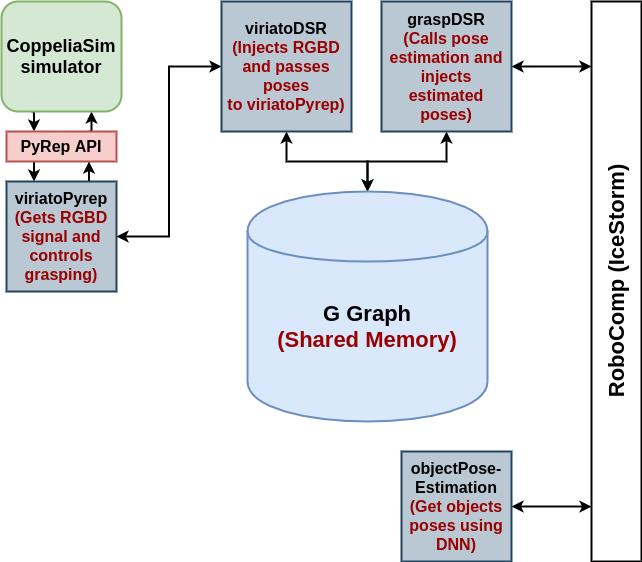
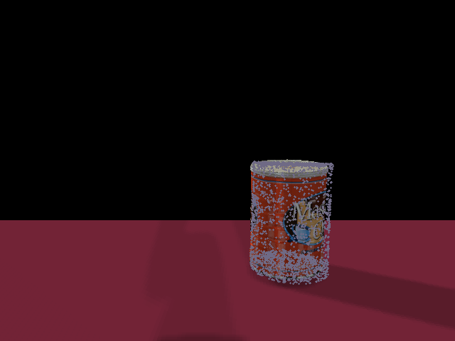
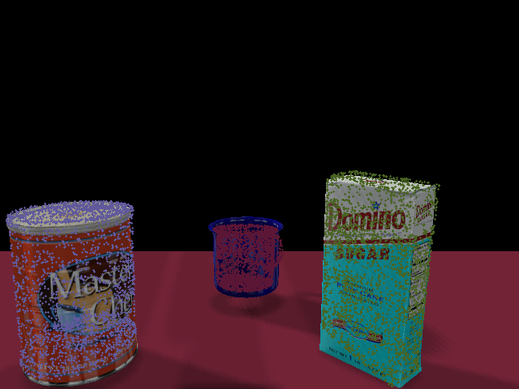

# GSoC 2020 Grasping and Pose Estimation

Repository created for GSoC work on grasping and pose estimation. 

__Project Title:__ DNN’s for precise manipulation of household objects.

## Usage

-   Clone the repository recursively :
```bash
git clone --recurse-submodules https://github.com/robocomp/grasping.git
```

-   Follow READMEs in each sub-folder for installation and usage instructions.

## Folder Structure

-   `components` : contains all _RoboComp_ interfaces and components.

-   `data-collector` : contains the code for custom data collection using _CoppeliaSim_ and _PyRep_.

-   `rgb-based-pose-estimation` : contains the code for [Segmentation-driven 6D Object Pose Estimation](https://arxiv.org/abs/1812.02541) neural network.

-   `rgbd-based-pose-estimation` : contains the code for [PVN3D](https://arxiv.org/abs/1911.04231) neural network as a git submodule.

## System Overview

<div align=center></div>

<div align="center">
Figure(1) : Complete schema for grasping and pose estimation workflow with DSR.
</div><br>

As shown in the figure, the components workflow goes as follows :

-   `viriatoPyrep` component streams the RGBD signal from CoppeliaSim simulator using PyRep API and publishes it to the shared graph through `viriatoDSR` component.

-   `graspDSR` component reads the RGBD signal from shared graph and passes it `objectPoseEstimation` component.

-   `objectPoseEstimation` component, then, performs pose estimation using DNN and returns the estimated poses.

-   `graspDSR` component injects the estimated poses into the shared graph and progressively plans dummy targets for the arm to reach the target object.

-   `viriatoDSR` component, then, reads the dummy target poses from the shared graph and passes it to `viriatoPyrep` component.

-   Finally, `viriatoPyrep` component uses the generated poses by `graspDSR` to progressively plan a successful grasp on the object.

## System Demos

### System Overview

Our system uses PyRep API to call embedded Lua scripts in the arm for fast and precise grasping. The provided poses are estimated using DNNs through RGB(D) data collected from the shoulder camera.

### First Demo (Path Planning)

This demo verifies the arm's path planning using DNN-estimated poses. 

<div align="center">
<a href="https://www.youtube.com/watch?v=It7z-Ujf73U"></a>
</div>

<div align="center">
Figure(2): Video of grasping first demo.
</div><br>

<div align=center></div>

<div align="center">
Figure(3): Visualization of the DNN-estimated pose in first demo.
</div><br>

### Second Demo (Grasping and Manipulation)

This demo shows the ability of the arm to grasp and manipulate a certain object out of multiple objects in the scene, using DNN-estimated poses.

<div align="center">
<a href="https://www.youtube.com/watch?v=lKk0_k8bjbY"></a>
</div>

<div align="center">
Figure(4): Video of grasping second demo.
</div><br>

<div align=center></div>

<div align="center">
Figure(5): Visualization of the DNN-estimated pose in second demo.
</div><br>
