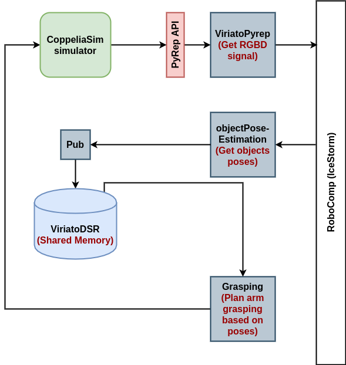

# Grasping and Pose Estimation Components

Here, we discuss the complete workflow of the components and elaborate the components interface and structure.

## Workflow Diagram



Figure(1) : Complete schema for grasping and pose estimation workflow.

As shown in the figure, the components workflow goes as follows :

- `ViriatoPyrep` component streams the RGBD signal from CoppelaSim simulator using PyRep API.

- `objectPoseEstimation` component receives RGB signal from `ViriatoPyrep` component and performs pose estimation through `Segmentation-driven 6D Object Pose Estimation` DNN.

- `objectPoseEstimation` component, then, passes the output poses to `objectPoseEstimationPub` component, which publishes the poses to the shared memory in `ViriatoDSR`.

- `Grasping` components stream the poses from the shared memory and use it to plan a grasp on the object.

## Pose Estimation Interfaces

As discussed, there are two components for pose estimation, which are `objectPoseEstimation` (Python) and `objectPoseEstimationPub` (C++).

### ObjectPoseEstimation Interface

It's the interface for `objectPoseEstimation` component. It defines a single operation `getObjectPose`, that takes a `TImage` from `CameraRGBDSimple` in `ViriatoPyrep` component and returns `PoseType`, which is a sequence of `ObjectPose` type.

`ObjectPose` type contains :
- String representing object name.
- Translation in x, y and z as floats.
- Euler angles in x, y and z as floats.

Here is `ObjectPoseEstimation` interface :

```
module RoboCompObjectPoseEstimation
{
    exception HardwareFailedException { string what; };

    sequence<byte> ImgType;

    struct TImage
    {
        int cameraID;
        int width;
        int height;
        int depth;
        int focalx;
        int focaly;
        int alivetime;
        ImgType image;
    };

    struct ObjectPose
    {
        string objectname;
        float x;
        float y;
        float z;
        float rx;
        float ry;
        float rz;
    };

    sequence<ObjectPose> PoseType;

    interface ObjectPoseEstimation
    {
        PoseType getObjectPose(TImage img) throws HardwareFailedException;
    };
};
```

### ObjectPoseEstimationPub Interface

It's the interface for `objectPoseEstimationPub` component. It defines a single operation `pushObjectPose`, which simply pushes the obtained object poses into the shared memory. 

Here is `ObjectPoseEstimationPub` interface :

```
import "ObjectPoseEstimation.idsl";

module RoboCompObjectPoseEstimationPub
{
  interface ObjectPoseEstimationPub
  {
    idempotent void pushObjectPose(RoboCompObjectPoseEstimation::PoseType poses);
  };
};
```