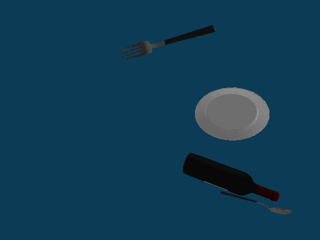
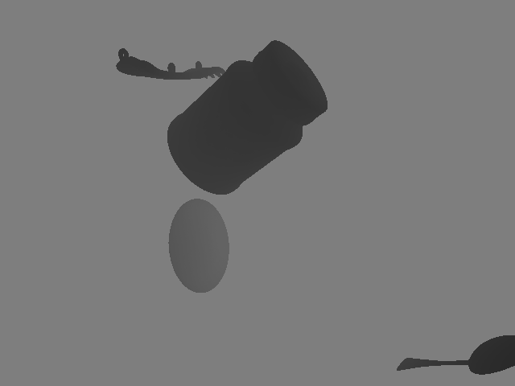
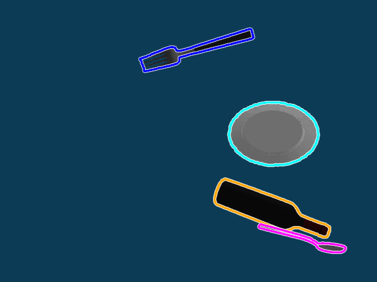

# Pose Estimation Data Collector (V-REP)

This is the code for data collection and preparation from V-REP simulator for training data augmentation.

**Note :** This data collector outputs data samples in YCB-Videos dataset format.

## Dependencies

-   [PyRep API](https://github.com/stepjam/PyRep) .
-   [Trimesh](https://github.com/mikedh/trimesh) .
-   [Open3D](https://github.com/intel-isl/Open3D) [[Build from Source](http://www.open3d.org/docs/release/compilation.html)] .

## Usage

1)  Create different scenes from provided meshes in `meshes` folder. Currently, the scene must contain 4 objects (named _Shape1_, _Shape2_, _Shape3_ and _Shape4_) and a vision sensor (named _cam_). 

**Notes :** 

-   Make sure that objects are centred around the world origin and that principal axes are aligned.

-   [free3d.com](https://free3d.com/) contains a wide collection of meshes that can be used for data augmentation.

-   Add new classes indices to json file with similar format to that in `meshes/new_classes.json` .

2)  Run `get_mesh_info.py` that generates bounding boxes and vertices files in `mesh_data` folder.

```bash
python get_mesh_info.py -bbp /path/to/original/bbox/file -vp /path/to/original/vertex/file -cl /path/to/classes/indices/json
```

3)  Run `collect_sim_data.py` that collects 5000 data samples from each scene in the provided directory and saves them to `sim_data` folder.

```bash
python collect_sim_data.py -sd /path/to/scenes/directory -cl /path/to/scenes/classes/json
```

Inputs :
-   scenes directory.
-   json file containing classes indices for each scenes.

For each output sample :
-   RGB image (with transparent background to be used as synthetic).
-   depth image.
-   Segmentation mask : labels mask for objects in the scene.
-   meta data : contains _cls_indexes_, _intrinsic_matrix_ and _poses_.
-   visualization image : contains visualizations for poses of all objects in the scene.

**Note :** new classes indices start from 22, as YCB-Videos dataset contains 21 classes.

4)  Add output data to the training dataset. The following data is required :
    -   RGB image (with transparent background to be used as synthetic).
    -   depth image.
    -   segmentation mask.
    -   meta data `.mat` file.
    -   new classes to `classes.txt` .
    -   new paths to `image_sets` .
    -   new `bbox.npy` .
    -   new `vertex.npy` .

## Output Samples

Here is a visual example of the data collector output :

<div align=center></div>

<div align="center">
Figure(1) : RGB output of the vision sensor.
</div><br>

<div align=center></div>

<div align="center">
Figure(2) : Depth output of the vision sensor.
</div><br>

<div align=center></div>

<div align="center">
Figure(3) : Segmentation mask of the RGB image.
</div><br>

<div align=center></div>

<div align="center">
Figure(4) : Visualization of the collected poses on the RGB image.
</div><br>
