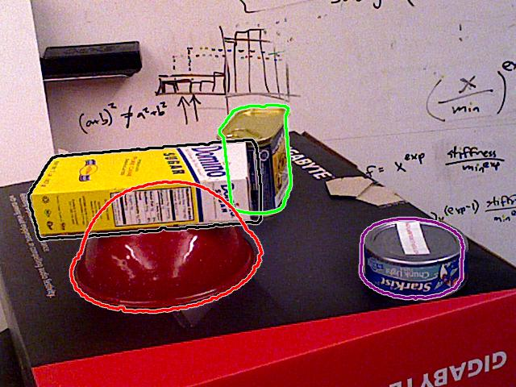
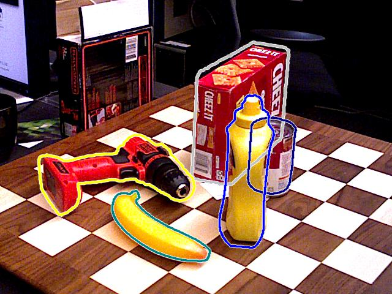
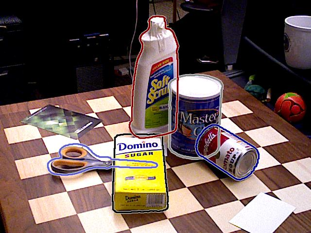
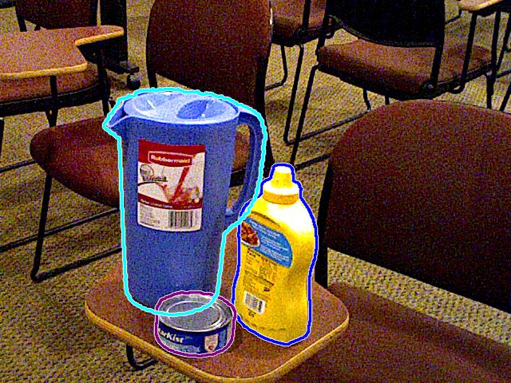
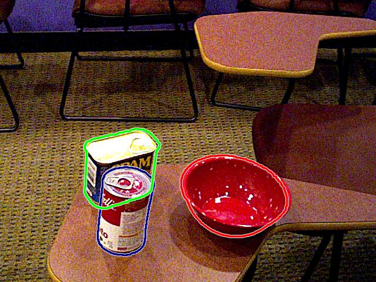
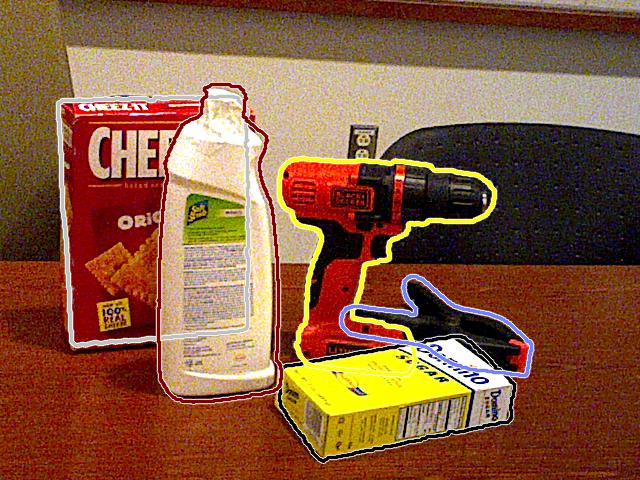
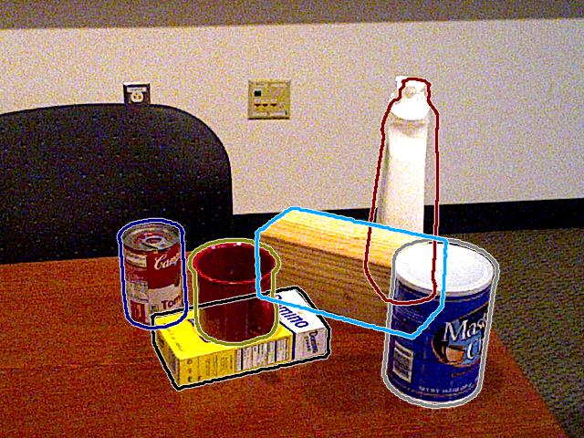

# Segmentation-Based Pose Estimation

-   [Introduction](#Introduction)
-   [Network Description](#Network-Description)
-   [Installation](#Installation)
-   [Usage](#Usage)
-   [Training Info](#Training-Info)
-   [Progress](#Progress)
-   [Experiments](#Experiments)
-   [Visual Results](#Visual-Results)

## Introduction

This is an implementation of [Segmentation-driven 6D Object Pose Estimation](https://arxiv.org/abs/1812.02541) paper based on the original implementation. This architecture is a single-shot segmentation-based network, in which the output points of interest and segmentation masks are fused using to RANSAC-based PnP  get the object pose.

Original implementation : https://github.com/cvlab-epfl/segmentation-driven-pose .

## Network Description

<div align=center></div>

<div align="center">
Figure(1): Network diagram from original paper.
</div><br>

A brief description of network :

1)  The input to the network is a simple RGB image.
2)  The network has an encoder of Darknet-53 from YOLOv3, which is used for feature extraction of input image.
3)  The network, then, has two streams :
    -   Segmentation stream : to produce the output segmentation masks (pixel-wise object classification).
    -   Regression stream : to get 2D keypoints corresponding to the 3D keypoints of the object in the world (object) frame. Usually, the keypoints are 8 vertices of the 3D bounding box.
4)  The output 2D keypoints are used to solve a 2D-3D correspondance problem with the 3D keypoints, using RANSAC-based PnP to get object pose (extrinsics), knowing the camera intrinsics. Also, the segmentation masks are used to define object class.

## Installation

-   Install `python3` and `python3-pip`.
-   Run :
```
pip3 install -r requirements.txt
```

## Usage

-   Download [YCB-Videos dataset](https://rse-lab.cs.washington.edu/projects/posecnn/) or [Occluded-LINEMOD datset](https://hci.iwr.uni-heidelberg.de/vislearn/iccv2015-occlusion-challenge/) .

-   Download the network pretrained weights of the required experiment. 

-   For training :

```
python train.py -ds dataset_name -dsp /path/to/dataset/root/dir -wp /path/to/weights/file -bg /path/to/background/images/dir -sn num_of_syn_samples --use_real 
```

-   For visual inference (outputs to `./output` directory):

```
python test.py -gpu True|False -ds dataset_name -dsp /path/to/dataset/root/dir -wp /path/to/weights/file
```

-   For metric evaluation :

```
python eval.py -dsp /path/to/dataset/root/dir -op /path/to/output/poses
```

-   For API functions :

`api.py` contains two functions, `configure_network` and `get_pose`, for dealing with external calls (through a component, for example). 

```python
import api

model = api.configure_network()

predicted_pose = api.get_pose(model, img, class_names, intrinsics, vertices)
```

-   For API test :

```
python api_test.py -ds dataset_name -img /path/to/test/image -wp /path/to/weights/file
```

-   For network traced script (used in C++ deployment) :

```
python get_trace.py -cfg /path/to/config/file -wp /path/to/weights/file -op /path/to/output/file
```

## Training Info

Training the network is conducted in the following settings :

-   Device : Nvidia Geforce RTX 2080 (VRAM = 8 GB).
-   Batch Size : 4 (6.5 GB).
-   Elapsed Time : 5.5 ~ 6 hours/epoch (on complete YCB-Videos dataset).

## Progress

-   [x] Understand, refactor and comment original repo code.

-   [x] Add basic code skeleton.

-   [x] Add training and dataset utilities.

-   [x] Add dataset class for YCB-Videos dataset.

-   [x] Add training forward propagation to network architecture.

-   [x] Add training script for network.

-   [x] Add evaluation scripts.

-   [x] Add API function (for inference in pose estimation component).

-   [x] Tune network losses and hyperparameters.

-   [x] Train the network on given dataset.

-   [x] Evaluate code validity and network performance.

-   [ ] Complete the listed training experiments.

## Experiments

-   [x] `exp-00` : Train the initial network implementation on YCB-Videos only ([pretrained weights file](https://drive.google.com/file/d/1N-qI5dqFVSNryZ0WwKlLn7npDkyVs_eh/view?usp=sharing)).

-   [x] `exp-01` : Train the initial network implementation on YCB-Videos and textureless custom objects ([pretrained weights file](https://drive.google.com/file/d/1nU1NfQCtcLLxUaKt1xKs98nFMAtKAsyf/view?usp=sharing)).

-   [x] `exp-02` : Train the network with focal loss on YCB-Videos and textureless custom objects ([pretrained weights file](https://drive.google.com/file/d/1GhN81L2lkgpmOqig9--cBX_7fFQM6NED/view?usp=sharing)).

-   [x] `exp-03` : Train the network with focal loss on YCB-Videos and textured custom objects ([pretrained weights file](https://drive.google.com/file/d/1N1WHYQdYQLK_GWWhlm_pbk0noyuWnpZv/view?usp=sharing)).

-   [x] `exp-04` : Train the network with focal loss on YCB-Videos only([pretrained weights file](https://drive.google.com/file/d/1MUG7aqhGXlubtSJHlmY0xbFdLRrAOTX-/view?usp=sharing)).

-   [ ] `exp-05` : Train the network with focal loss on synthetic and real YCB-Videos data.

## Visual Results

<div align=center></div>

<div align="center">
Figure(2): Results of pose estimation on YCB-Videos dataset based on exp-04.
</div><br>

<div align=center></div>

<div align="center">
Figure(3): Results of pose estimation on YCB-Videos dataset based on exp-04.
</div><br>

<div align=center></div>

<div align="center">
Figure(4): Results of pose estimation on YCB-Videos dataset based on exp-04.
</div><br>

<div align=center></div>

<div align="center">
Figure(5): Results of pose estimation on YCB-Videos dataset based on exp-04.
</div><br>

<div align=center></div>

<div align="center">
Figure(6): Results of pose estimation on YCB-Videos dataset based on exp-04.
</div><br>

<div align=center></div>

<div align="center">
Figure(7): Results of pose estimation on YCB-Videos dataset based on exp-04.
</div><br>

<div align=center></div>

<div align="center">
Figure(8): Results of pose estimation on YCB-Videos dataset based on exp-04.
</div><br>

<div align=center></div>

<div align="center">
Figure(9): Results of pose estimation on YCB-Videos dataset based on exp-04.
</div><br>
