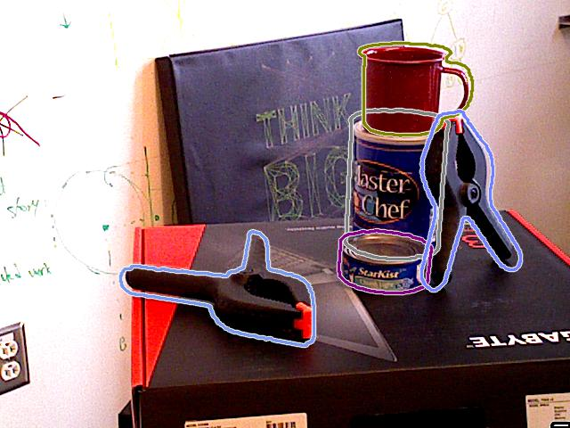

# Segmentation-Based Pose Estimation

This is an implementation of [Segmentation-driven 6D Object Pose Estimation](https://arxiv.org/abs/1812.02541) paper based on the original implementation. This architecture is a single-shot segmentation-based network, in which the output points of interest and segmentation masks are fused using to RANSAC-based PnP  get the object pose.

Original implementation : https://github.com/cvlab-epfl/segmentation-driven-pose .

# Installation

- Install `python3` and `python3-pip`.
- Run :
```
pip3 install -r requirements.txt
```

## Usage

- Download [YCB videos dataset](https://rse-lab.cs.washington.edu/projects/posecnn/) or [Occluded-LINEMOD datset](https://hci.iwr.uni-heidelberg.de/vislearn/iccv2015-occlusion-challenge/) .

- Download [pretrained weights for YCB dataset](https://drive.google.com/file/d/1N-qI5dqFVSNryZ0WwKlLn7npDkyVs_eh/view?usp=sharing) . 

- For training :

```
python train.py -ds <dataset_name> -dsp </path/to/dataset/root/dir> -wp </path/to/weights/file> -bg </path/to/background/images/dir>
```

- For visual inference (outputs to `./output` directory):

```
python test.py -gpu <boolean> -ds <dataset_name> -dsp </path/to/dataset/root/dir> -wp </path/to/weights/file>
```

- For metric evaluation :
```
python eval.py -dsp </path/to/dataset/root/dir> -op </path/to/output/poses>
```

- For API functions :

`api.py` contains two functions, `configure_network` and `get_pose`, for dealing with external calls (through a component, for example). 

```python
import api

model = api.configure_network()

predicted_pose = api.get_pose(model, img, class_names, intrinsics, vertices)
```


## Training Info

Training the network is conducted in the following settings :

- Device : Nvidia Geforce RTX 2080 (VRAM = 8 GB).
- Batch Size : 4 (6.5 GB).
- Elapsed Time : 5.5 ~ 6 hours/epoch.

## Progress

[x] Understand, refactor and comment original repo code.

[x] Add basic code skeleton.

[x] Add training and dataset utilities.

[x] Add dataset class for YCB videos dataset.

[x] Add training forward propagation to network architecture.

[x] Add training script for network.

[x] Add evaluation scripts.

[x] Add API function (for inference in pose estimation component).

[x] Train the network on given dataset.

[x] Evaluate network performance.

## Visual Results (From VREP)



Figure(1): Results of pose estimation in VREP simulator on seen objects during training.
